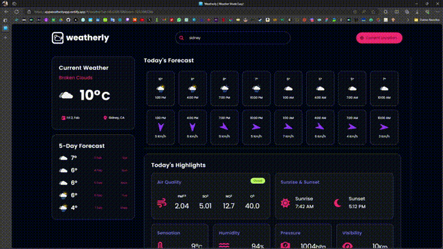
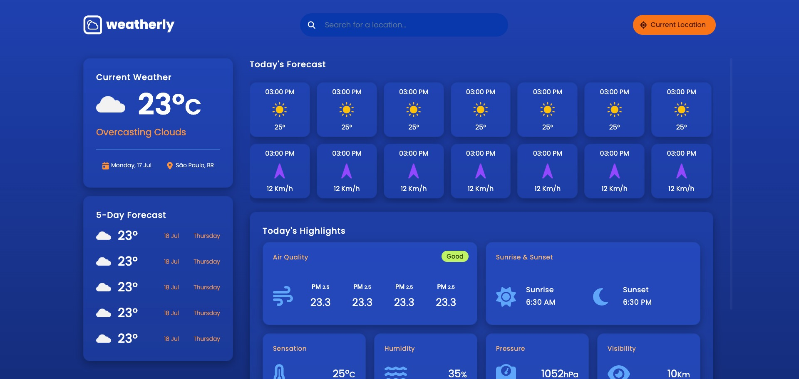

# Weatherly

Este repositório contém o código do Weatherly, uma aplicação desenvolvida como parte do projeto final do curso de JavaScript da Coderhouse. O objetivo do aplicativo é fornecer informações meteorológicas precisas e atualizadas em tempo real para uma determinada localização.

## Tech Stack

**Client:** HTML, CSS, JavaScript e Integração de API.

## Demo



## Features

1. <b>Real-time Search</b>:

- Fornece uma funcionalidade de busca para que os usuários possam encontrar informações climáticas para diferentes localidades. Os usuários podem digitar o nome de uma localidade, e o aplicativo irá buscar resultados de busca em tempo real à medida que eles digitam.

2. <b>Location Results</b>:

- Os resultados da busca são exibidos em formato de lista. Cada resultado de busca inclui o nome, estado (se disponível) e país da localidade. Os usuários podem selecionar uma localidade nos resultados para visualizar as informações climáticas para essa localidade.

3. <b>Current Weather Information</b>:

- Quando uma localidade é selecionada, o aplicativo exibe as informações climáticas atuais. As informações climáticas incluem temperatura, descrição do clima, ícone do clima, data e nome da localidade.

4. <b>Hourly Forecast</b>:

- O aplicativo fornece uma previsão climática horária para a localidade selecionada. As informações climáticas horárias incluem temperatura, ícone do clima e velocidade do vento.

5. <b>5-Day Forecast</b>:

- O aplicativo também exibe uma previsão climática de 5 dias para a localidade selecionada. A previsão de cada dia inclui a temperatura máxima e o ícone do clima.

6. <b>Air Quality Highlights</b>:

- O aplicativo mostra destaques da qualidade do ar para a localidade selecionada. Os dados de qualidade do ar incluem os níveis de PM2.5, SO2, NO2 e O3. Um distintivo de Índice de Qualidade do Ar (AQI) é exibido com o nível correspondente e a descrição.

7. <b>Sunrise & Sunset Times</b>:

- O aplicativo fornece os horários de nascer e pôr do sol para a localidade selecionada.

8. <b>Sensation, Humidity, Pressure, and Visibility</b>:

- O aplicativo exibe informações adicionais sobre o clima, incluindo a sensação térmica (temperatura aparente), umidade, pressão e visibilidade.

9. <b>Error Handling</b>:

- O aplicativo lida com erros, como um erro 404 quando a localidade solicitada não é encontrada.

## Screenshots



## Run Locally

Clone o projeto:

```bash
  git clone https://github.com/sauloviniciust/projetofinal
```

Vá até o diretório do projeto que você clonou:

```bash
  cd projetofinal
```

Abra com o VS Code:

```bash
  code .
```

Com o projeto aberto, no diretório `scripts` crie um arquivo chamado `key.js`

Vá até https://openweathermap.org/ e crie sua conta.

Com a conta criada, clique no seu nome no canto direito superior e procure por `My API Keys`

Copie e cole sua chave no arquivo `key.js` criado anteriormente no formato abaixo:

```javascript
const OPEN_WEATHER_API_KEY = 'SUA CHAVE AQUI!';

export default OPEN_WEATHER_API_KEY;
```

Abra com o live server

## Authors

- [@sauloviniciust](https://www.github.com/sauloviniciust)
- [@ynncstslv](https://www.github.com/ynncstlsv)

## Additional Notes

Este aplicativo é uma demonstração prática das habilidades adquiridas por Saulo Vinícius e Yann Costa e Silva durante o curso de JavaScript da Coderhouse, combinando conhecimentos de programação, manipulação de APIs e design de interfaces.
